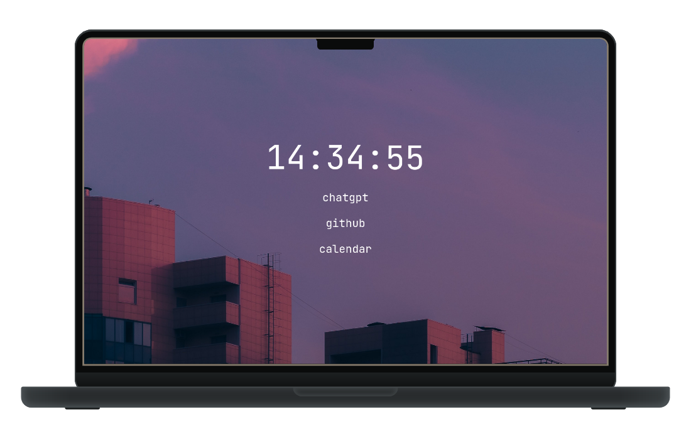

<br />
<p align="center">
  

  <h3 align="center">startpage</h3>
  <p align="center">simple startpage with quick access links and the current time.</p>
</p>

<div align="center" style="display: flex; flex-direction: column;">
  <a href="https://startpage.landmann.ph/">
    
  </a>
</div>

## Configuration

To edit the links, edit the `#bookmarks` item in `index.html`.

You can customize the start page background by editing the `config.json` file. Here's what the configuration file looks like:

```json
{
  "backgroundFile": "wallpaper/evening-sky.png",
  "backgroundColor": "#0a0a0a"
}
```

- `backgroundFile`: relative path to the background image file. 
- `backgroundColor`: The color to be used as the background color.

You can use a script to automatically sync the wallpaper and colors to your main system, so the start page has the same wallpaper as your PC.

## Usage

1. Clone this repository.
2. Open `index.html` to edit your links.
3. Host it as a static website on `localhost`.
4. Set it as homepage in your browser and as a new tab page using the [New Tab](https://addons.mozilla.org/en-US/firefox/addon/newtab-ext/)-extension.